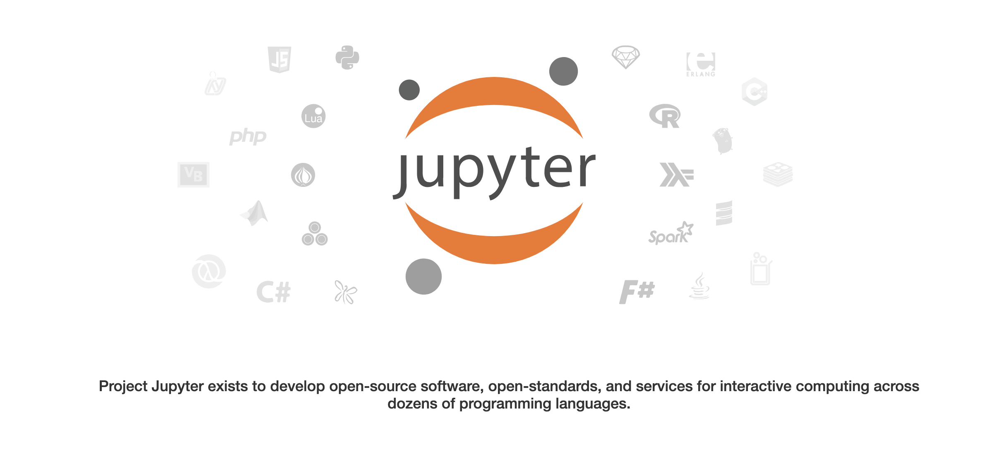
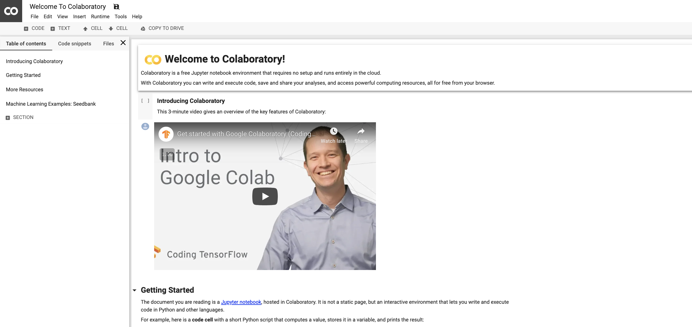
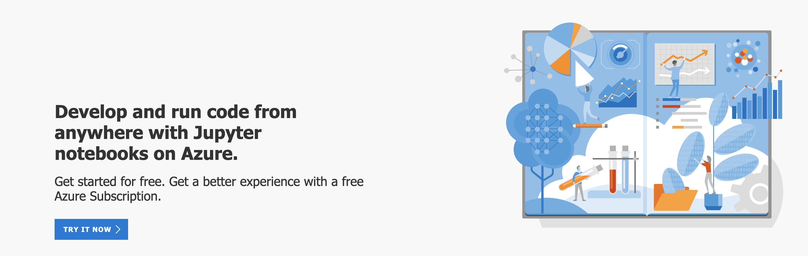
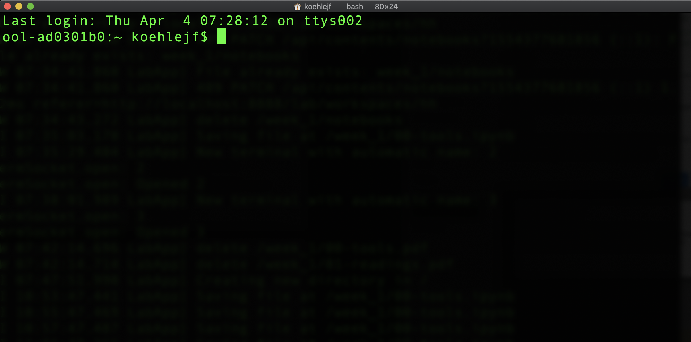
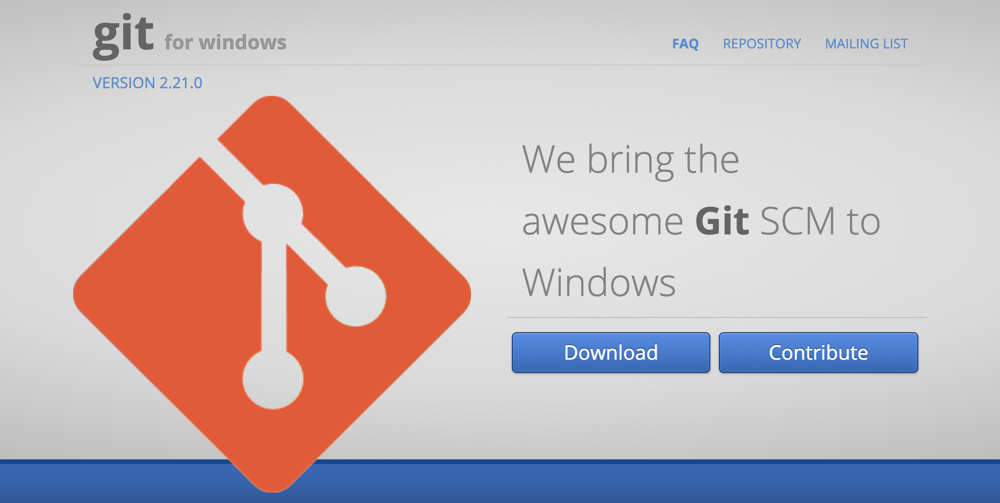

# Week 1: Getting Started with AI and ML 

This week we focus on introducing popular tools and interfaces for using Artificial Intelligence and Machine Learning.

# Tools for AI

There are many language new and old capable of carrying out Machine Learning and Artificial Intelligence oriented tasks.  In recent years, a few open source tools have come to dominate the space.  This guide is meant to give you a high level overview of some tools that are freely accessible and ready to plug and play with ML and AI algorithms.

## Languages

According to the StackOverflow developer survey of 2018, Python is the dominant language for data scientists and machine learning specialists.  Additionally,  the R language, and the SQL database query language, and a newer language that is also gaining speed called Julia. ([StackOverflow survey](https://insights.stackoverflow.com/survey/2018/#technology))

All of these languages are freely accessible and open source projects.  Below, you will find links to each languages major documentation.  We will discuss a tool for putting these languages to use next.  Later, we focus on introducing the Python computing language and it's Pandas library for working with data.

- Python official documentation:https://www.python.org/
- Julia language official documentation: https://julialang.org/ 
- R documentation:https://www.r-project.org/
- MySQL documentation: https://dev.mysql.com/doc/refman/8.0/en/

## Jupyter Notebooks

    

Jupyter notebooks ([jupyter.org](https://jupyter.org/)) are a powerful tool for interacting with many different languages.  The name indicates the connection to Julia, Python, and R.  They offer an interactive web based interface to use many languages including the initial three.  You can download the notebooks freely through the Anaconda distribution ([here](https://www.anaconda.com/download)).  The notebooks run locally in your web browser once installed.

Also, a few companies have begun to offer Jupyter notebooks through just a web browser.  We will examine a few options in the following section.  The notebooks are a wonderful tool for teams and for communicating and sharing results with stakeholders.

- Videos from Software Carpentry ([Carpentries Site]()) on installing and getting started with Jupyter notebooks.  
 - Mac: https://www.youtube.com/watch?v=TcSAln46u9U
 - Windows: https://www.youtube.com/watch?v=xxQ0mzZ8UvA
 
 
 
 
- Introduction to Jupyter notebooks tutorial from Real Python: https://realpython.com/jupyter-notebook-introduction/

### Jupyter Notebooks on the Web

**GOOGLE COLAB**

    

Both Google and Microsoft have recently opened up versions of the Jupyter notebooks for use online.  For Google, the notebooks are integrated into your google drive, and are accessible at [https://colab.research.google.com](https://colab.research.google.com/notebooks/welcome.ipynb) .  If you have a google login, you can use this to login and save your notebooks to your google drive.  More importantly, you can use google's computational resources to tap GPU resources.

Collab has a number of tutorials available for getting up and running with Machine Learning in the cloud:

- Getting Started with Collab: https://colab.research.google.com/notebooks/basic_features_overview.ipynb
- Loading Data in Colab: https://colab.research.google.com/notebooks/io.ipynb
- Introduction to Pandas: https://colab.research.google.com/notebooks/mlcc/intro_to_pandas.ipynb

**Microsoft Azure Notebooks**

Microsoft's Azure Notebooks are similar to Google's offering.  They are accessible through a web browser, and can be configured to access additional processing power.  They are accesible at [https://notebooks.azure.com/](https://notebooks.azure.com/).

    

Like Google, Microsoft has a number of tutorials to get up and running with the notebooks.  

- Accessing Data with Azure: https://notebooks.azure.com/Microsoft/projects/2018-data-access
- Introduction to Python for Data Analysis: https://notebooks.azure.com/wesm/projects/python-for-data-analysis

## Software for Local Computers

**UNIX on Mac**

    

When working locally, we will frequently want to interact with the file system of the machine to create, delete, move, and copy files.  Typically, we will use the terminal application to execute this code.  On a Mac, you have a terminal application already installed.  You can find this by using the search bar looking for the **Terminal** application.  

**GitBash on Windows**

    

On a Windows machine, certain commands can be executed in the Power Shell, but it is easier to download and install a different application to interact with UNIX.  [GitBash](https://git-for-windows.github.io/) is a common application for Windows users.  

    
**WARNING!!**: Be sure to choose the "ADD TO PATH" box during the installation process so you can access your other programs including Python and Jupyter notebooks.
    

**Resources for Learning Bash**

- Software Carpentry lessons on UNIX shell: http://swcarpentry.github.io/shell-novice/

### “G-MAFIA”: Training from Technology Leaders in the US 

**[Google Cloud Platform (GCP) Training Catalog](https://cloud.google.com/training/course-catalog)** 

Focuses on developing skills to design, deploy and maintain Google Cloud technologies by providing an overview of the platform, tools and APIs.  

  

**[Microsoft Machine Learning School](https://aischool.microsoft.com/en-us/machine-learning/learning-paths) | [Machine Learning APIs](https://gallery.azure.ai/machineLearningAPIs) **

Microsoft launched various programs and tracks to educate how its solutions can be used to solve machine learning problems 

  

**[Amazon Web Services (AWS) Machine Learning Training](https://aws.amazon.com/training/learning-paths/machine-learning/)** 

Amazon opened the same machine learning courses used to train its engineers to all developers through AWS. 

  

**[Facebook Facebook Guide to Machine Learning](https://research.fb.com/the-facebook-field-guide-to-machine-learning-video-series/)** 

Facebook has a variety of training videos and documentation around the use of machine learning at the company and general conceptual introductions. 

  

**[IBM IBM Watson Academy](https://www-03.ibm.com/services/learning/ites.wss/zz-en?pageType=page&c=LNW1G2K9220IL0YX)**

IBM offers a range of trainings including the use of its famous Watson library for Machine Learning and Artificial Intelligence. 

  

**[Apple Machine Learning and Development at Apple](https://developer.apple.com/machine-learning/)**

Apple allows developers to implement machine learning models to integrate with all products including training on integrating outside systems like IBM’s Watson. 

  

**[BAT”: Training from Technology Leaders in China](http://ai.baidu.com/ezdl/case)**

Baidu has a tool that allows easy model building for many business specific use cases. 

  

**[Alibaba Machine Learning Platform for AI](https://www.alibabacloud.com/help/product/30347.htm?spm=a2c63.m28257.a1.83.67625922VRSZSn)**

Alibaba offers a cloud computing platform meant to ease the user interface with Maching Learning and Artificial Intelligence algorithms. 

  

**[Tencent AI Open Platform](https://ai.qq.com/doc/home.shtml)**

Tencent’s platform focuses heavily on image and text algorithms. 

  

### Mathematical Models & Algorithms 

  

**Supervised Learning **

-----------

Regression:  

  

- Refresher on Regression Analysis: 

 https://hbr.org/2015/11/a-refresher-on-regression-analysis 

- Seven types of Regression you should know: 

https://www.analyticsvidhya.com/blog/2015/08/comprehensive-guide-regression/ 

- Explaining Regularization: 

http://enhancedatascience.com/2017/07/04/machine-learning-explained-regularization/ 

  

Classification: 

  

- Introduction to KNearest Neighbors:  

http://dataaspirant.com/2016/12/23/k-nearest-neighbor-classifier-intro/ 

- All about Logistic Regression: 

https://towardsdatascience.com/logistic-regression-b0af09cdb8ad 

- How the Decision Tree Algorithm Works: 

http://dataaspirant.com/2017/01/30/how-decision-tree-algorithm-works/ 

- Introduction to Naïve Bayes Classifier: 

https://towardsdatascience.com/naive-bayes-classifier-81d512f50a7c 

  

**Unsupervised Learning:**

  

Clustering:  

  

- An introduction to KMeans clustering: 

 https://www.datascience.com/blog/k-means-clustering 

- Wikipedia page on KMEANS:  

https://en.wikipedia.org/wiki/K-means_clustering 

- DBScan clustering description on Wikipedia: 

https://en.wikipedia.org/wiki/K-means_clustering 

- Clustering in SciKitLearn: 

https://scikit-learn.org/stable/modules/clustering.html 

  

 

Dimensionality Reduction: 

  

- Principal Component Analysis:  

https://towardsdatascience.com/a-one-stop-shop-for-principal-component-analysis-5582fb7e0a9c 

- Singular Value Decomposition: 

https://en.wikipedia.org/wiki/Singular_value_decomposition 

  

  

**Noteworthy AI Communities & Blogs**

  

Jupyter Blog: Official blog for the Jupyter notebook project - https://blog.jupyter.org/tagged/jupyter-notebook 

- Medium: Towards Data Science strand of blogs that aggregate relevant data science topics https://medium.com/towards-data-science/data-science/home 

- Andrew Ng Blog: Fundamental contributor to the field including famous introduction to AI course on Coursera https://medium.com/@andrewng 

- Data Science Central: Community of big data practioners and wide range of topical posts https://www.datasciencecentral.com/ 

- Google’s AI Blog: Blog discussing many techniques and applications in AI https://ai.googleblog.com/ 

- Deepmind Blog: Company responsible for AlphaGo and other recent advances in reinforcement learning https://deepmind.com/blog/ 

  